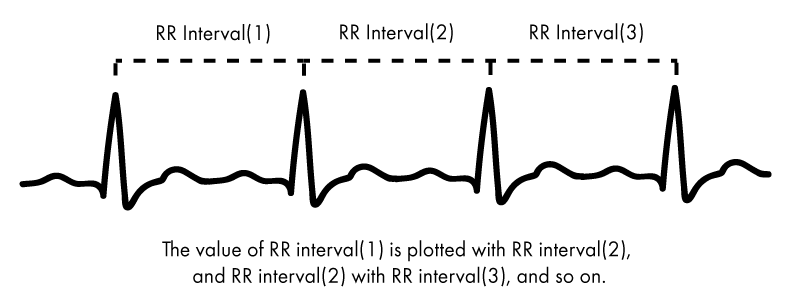

**ECG**

- Some basic [terms](https://www.physionet.org/tutorials/hrv/#hr-extraction)
  - [QRS](https://en.wikipedia.org/wiki/QRS_complex): The QRS complex is a name for the combination of three of the graphical deflections seen on a typical electrocardiogram (EKG or ECG). In other words, it's the main spike seen on an ECG line.
    
	
  - [R-R interval](https://emedicine.medscape.com/article/2172196-overview)
    
  - [Normal-to-Normal(NN) interval](https://psychology.stackexchange.com/questions/16076/what-is-the-difference-between-rr-intervals-and-nn-intervals-in-hrv-data) (filter RR intervals to produce NN intervals): all intervals between adjacent QRS complexes resulting sinus node depolarization.
     - The difference between RR interval and NN interval: NN intervals refer to the intervals between **normal** R-peaks. During a measurement, artifacts may arise due to arrhythmic events or faulty sensors, for example (Citi, Brown & Barbieri, 2012). This may lead to abnormal R-peaks, which may in turn distort the statistical measures. To ensure reliable and valid data, only normal R-peaks are selected. Alternatively, the abnormal R-peaks can be corrected. 
	 In practice, however, RR-intervals and NN-intervals are synonymous (Tarvainen, 2014; Wiki). The use of "NN-intervals" is merely used to emphasize that normal R-peaks were used. 
  - [Heart Rate](https://en.wikipedia.org/wiki/Heart_rate): [The instantaneous heart rate](https://courses.kcumb.edu/physio/ecg%20primer/normecgcalcs.htm) can be calculated from the time between any two QRS complexes. 
- Heart rate variability:
  - [HRV standards,1996](https://www.ncbi.nlm.nih.gov/pubmed/8737210)
     
	 
	 
	 
	 
	 - Notes from SX:
	 ```
	   HF, is associated with respiratory sinus arrhythmia, and has been attributed to parasympathetic (vagal) activity, LF is assumed to be under the influence of both parasympathetic and sympathetic activity, but predominately by sympathetic activity.
 
       In the frequency domain both low frequency (LF: 0.04–0.15 Hz) and high frequency (HF: 0.15–0.40 Hz) spectral powers have been used as indices of vagal activity, although there is some debate over the branch of the autonomic system that affects these measures [20]. Whereas there is little contention concerning HF power reflecting primarily parasympathetic influences, LF power has been shown to reflect both sympathetic and parasympathetic influences. 

       LF/HF ratio (a putative measure of sympathovagal balance where higher numbers indicate greater relative sympathetic dominance) 

       Also, the root mean square successive differences (RMSSD), and measures of baroreflex sensitivity (an index of the responsiveness of the cardiovascular system to changes in blood pressure) have been shown to be useful indices of vagal activity. 
     ```
	 
  - [wikipedia HRV](https://en.wikipedia.org/wiki/Heart_rate_variability)
  - [Heart rate variability – a historical perspective, 2011](https://www.frontiersin.org/articles/10.3389/fphys.2011.00086/full)
  - [An introduction to heart rate variability: methodological considerations and clinical applications, 2015](https://www.frontiersin.org/articles/10.3389/fphys.2015.00055/full#B1)
  

 - PhysioNet, 2016: [WFDB Toolbox for MATLAB and Octave](https://www.physionet.org/physiotools/matlab/wfdb-app-matlab/)
     -  Test "Usage" **example**: refer to Github [mhrv](https://github.com/physiozoo/mhrv) (main function toolbox): 
	   
	    1. Initialize MATLAB environment of the mhrv tools: 
		```
		mhrv_init [-f/--force];
		```
		2. If there is no example dataset,download the mitdb/111 record from PhysioNet to local folder named 'db': 
		```
		download_wfdb_records('mitdb', '111', 'db')';
		```  	
		3. Run HRV analysis: 
		```
		mhrv('db/mitdb/111', 'window_minutes', 15, 'plot', true);
		```
        - key functions:
		  ```
		  wfdb_header - Read record metadata from a WFDB header file (.hea).
		  ecgrr - Construction of RR intervals from ECG data in PhysioNet format.
		    - ecgrr calls **rqrs** (Detection of R-peaks in ECG signals (based on PhysioNet's gqrs). Configurable for use with both human and animal ECGs._
			- rqrs calls **jqrs/wjqrs** (An ECG peak-detector based on a modified Pan & Tompkins algorithm and a windowed version.
		  filtrr - Filtering of RR interval time series to detect ectopic (out of place) beats.
		  hrv_time - Time Domain: AVNN, SDNN, RMSSD, pNNx.
		  hrv_freq - Frequency Domain: 
			- Total and normalized power in (configurable) VLF, LF, HF and custom user-defined bands.
			- Spectral power estimation using Lomb, Auto Regressive, Welch and FFT methods.
			- Additional frequency-domain features: LF/HF ratio, LF and HF peak frequencies, power-law scaling exponent (beta).
		  ```	  
		  
	    - Notes: 
		  - Missing padarray function (from Image Processing Toolbox); here using several [online functions](https://github.com/gpeyre/matlab-toolboxes/tree/master/toolbox_nlmeans/toolbox/ordfilt2) ([padarray.m](padarray.m) calls [checkstrs.m](checkstrs.m) and [mkconstarray.m](mkconstarray.m)) to substitute.
		  - [File Format from Q&A](https://physionet.org/faq.shtml): 
		     - MIT Signal files (.dat) are binary files containing samples of digitized signals. These store the waveforms, but they cannot be interpreted properly without their corresponding header files. These files are in the form: RECORDNAME.dat.
			 - MIT Header files (.hea) are short text files that describe the contents of associated signal files. These files are in the form: RECORDNAME.hea.
			 - MIT Annotation files are binary files containing annotations (labels that generally refer to specific samples in associated signal files). Annotation files should be read with their associated header files. If you see files in a directory called RECORDNAME.dat, or RECORDNAME.hea, any other file with the same name but different extension, for example RECORDNAME.atr, is an annotation file for that record.
	      - Modify default parameter values of the mhrv toolbox: you can edit [cfg/defaults.yml](defaults.yml), and [cfd/gqrs.conf](gqrs.default.conf)
     
	 - Work on our ECG and RR-interval data output from [Biomonitor](https://www.noraxon.com/noraxon-download/dts-biomonitor-user-manual/):
	    - confirm the RR-interval output:
		  - normal RR interval [range](https://emedicine.medscape.com/article/2172196-overview): 0.6-1.2 seconds; 
		  - more information on [peak detection](https://docs.physiozoo.com/en/stable/sections/tutorials/peakdetection.html) 
		  - modify the [cfd/gqrs.conf](gqrs.default.conf):
		    - current default: 
			```
			RRdelta	0.2	# Typical difference between successive RR intervals in seconds
            RRmin	0.28	# Minimum RR interval ("refractory period"), in seconds
		    ```
			- Change to 
			```
			RRdelta	0.6	# Typical difference between successive RR intervals in seconds
            RRmin	0.6	# Minimum RR interval ("refractory period"), in seconds
			```
		    - see [ECG2RRi_test.m](ECG2RRi_test.m)
			
			- also check [mhrv_fatigue_test.m](mhrv_fatigue_test.m) (which calls [interparc.m](interparc.m))
		
		- remove the flat 'steps" of the RR-interval data
		
		
 - Maybe test the online dataset in the future: [Stress Recognition in Automobile Drivers](https://physionet.org/physiobank/database/drivedb/)
 
  
 - Other realted tools and reading:
 

	- Kaufmann, 2011: [ARTiiFACT](http://www.artiifact.de/) 
	- [Kubios: from XS](https://www.kubios.com/gallery/)
	- Vollmer, 2017 (HRVTool v0.99 from Github): [MarcusVollmer/HRV](https://github.com/MarcusVollmer/HRV)
	- [PhysioZoo](https://physiozoo.com/)
        - Github [webpage](https://github.com/physiozoo)
	  - Github [physiozoo](https://github.com/physiozoo/physiozoo)
	- from imotions: [HRV and brain](https://imotions.com/blog/heart-rate-variability/)
